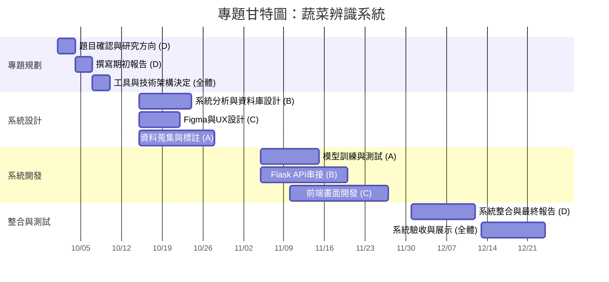
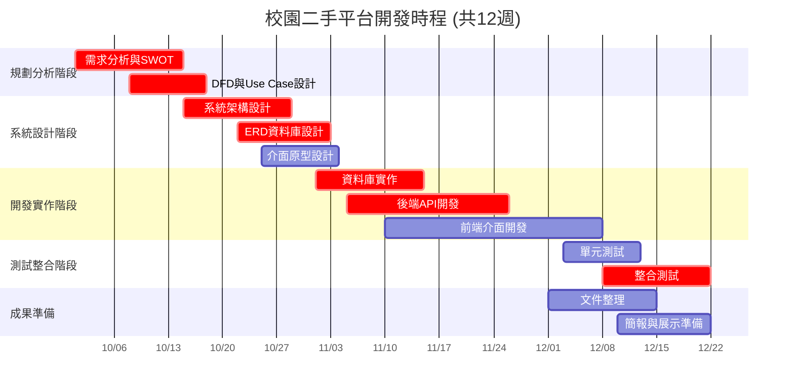
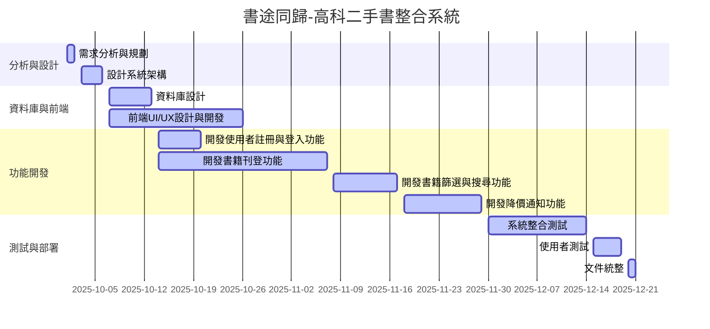
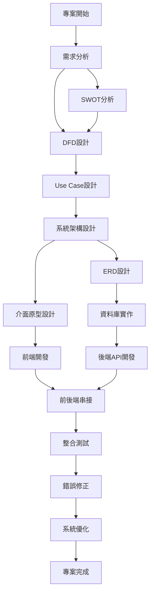

## 成員與職責分工

| 代號 | 負責領域 | 主要工作職責說明 |
|:---------:|:----------|:----------------|
| **A** | **AI 模型開發** | 收集並標註蔬菜影像資料、訓練 YOLO / TensorFlow 模型、測試與調整辨識結果、輸出可用推論模型供前後端串接。 |
| **B** | **後端開發** | 規劃系統架構與資料流程、建立 Flask API、串接農委會市價資料、設計與管理資料庫（蔬菜、市價、歷史紀錄表）。 |
| **C** | **前端 / UIUX 設計** | 使用 Figma 設計網站與行動端介面、負責網頁畫面實作（上傳拍照、顯示辨識結果、市價資訊等）、整合使用者體驗設計。 |
| **D** | **文件與系統整合** | 專題管理與文件撰寫（期初、期末報告）、協調組員進度、整合各模組測試與修正、負責簡報與成果影片製作。 |
| **全體** | **專題討論與驗收** | 共同討論開發方向、進行整合測試、修正使用者體驗、進行 DEMO 與成果展示。 |

# 甘特圖

# 甘特圖

# PERT/CPM 圖

