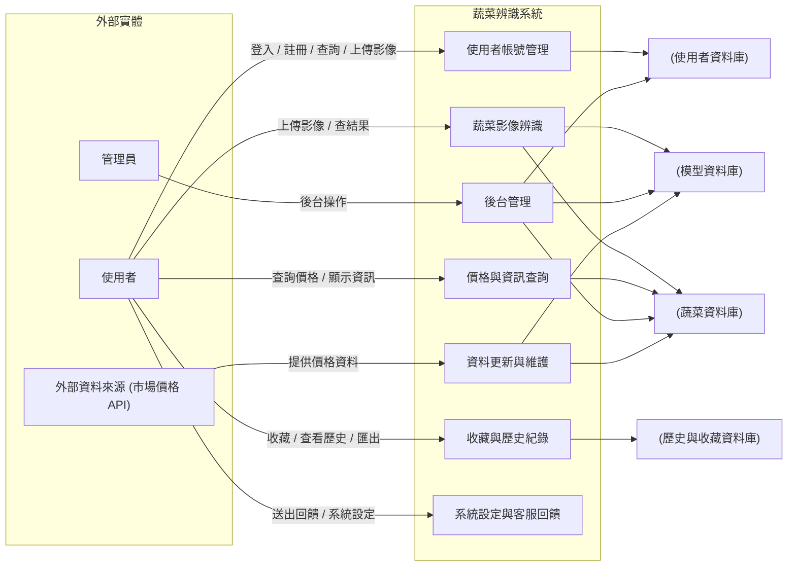
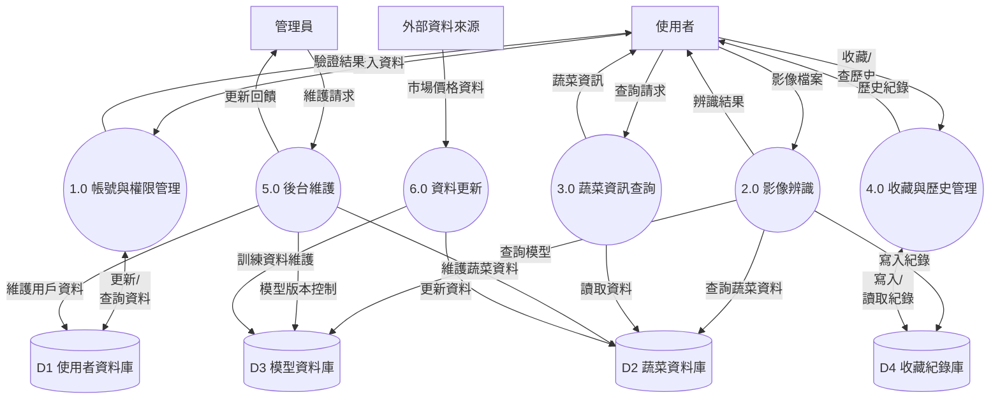
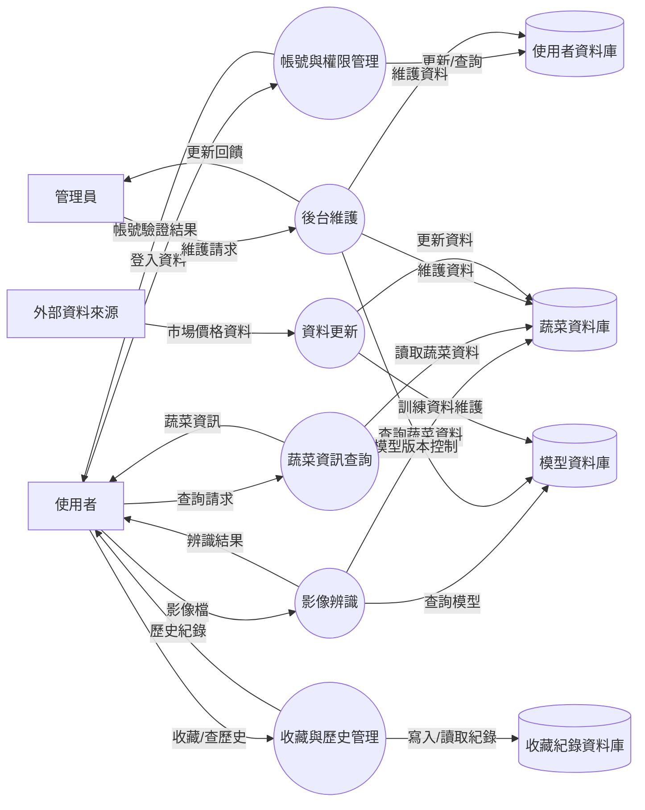

```mermaid
flowchart LR
  %% 外部實體
  subgraph External["外部實體"]
    U["使用者"]
    M["管理員"]
    API["外部資料來源 (市場價格 API)"]
  end

  %% 系統主體
  subgraph System["蔬菜辨識系統"]
    A["使用者帳號管理"]
    B["蔬菜影像辨識"]
    C["價格與資訊查詢"]
    D["收藏與歷史紀錄"]
    E["後台管理"]
    F["資料更新與維護"]
    G["系統設定與客服回饋"]
  end

  %% 資料儲存
  UserDB["(使用者資料庫)"]
  VegDB["(蔬菜資料庫)"]
  HistDB["(歷史與收藏資料庫)"]
  ModelDB["(模型資料庫)"]

  %% 流向
  U -->|登入 / 註冊 / 查詢 / 上傳影像| A
  U -->|上傳影像 / 查結果| B
  U -->|查詢價格 / 顯示資訊| C
  U -->|收藏 / 查看歷史 / 匯出| D
  U -->|送出回饋 / 系統設定| G

  M -->|後台操作| E
  API -->|提供價格資料| F

  %% 模組與資料庫互動
  A --> UserDB
  B --> ModelDB
  B --> VegDB
  C --> VegDB
  D --> HistDB
  E --> UserDB
  E --> VegDB
  E --> ModelDB
  F --> VegDB
  F --> ModelDB
```

```mermaid
flowchart TD
  %% 外部實體
  U[使用者]
  M[管理員]
  API[外部資料來源]

  %% 系統處理（圓形）
  P1((1.0 帳號與權限管理))
  P2((2.0 影像辨識))
  P3((3.0 蔬菜資訊查詢))
  P4((4.0 收藏與歷史管理))
  P5((5.0 後台維護))
  P6((6.0 資料更新))

  %% 資料儲存（圓柱體）
  D1[(D1 使用者資料庫)]
  D2[(D2 蔬菜資料庫)]
  D3[(D3 模型資料庫)]
  D4[(D4 收藏紀錄庫)]

  %% 資料流

  %% 1. 使用者 - 帳號/權限 (P1) - D1
  U -- 登入資料 --> P1
  P1 -- 驗證結果 --> U
  P1 <-->|更新/<br/>查詢資料| D1

  %% 2. 使用者 - 影像辨識 (P2)
  U -- 影像檔案 --> P2
  P2 -- 辨識結果 --> U
  P2 -- 查詢模型 --> D3
  P2 -- 查詢蔬菜資料 --> D2
  P2 -- 寫入紀錄 --> D4
  
  %% 3. 使用者 - 資訊查詢 (P3)
  U -- 查詢請求 --> P3
  P3 -- 蔬菜資訊 --> U
  P3 -- 讀取資料 --> D2

  %% 4. 使用者 - 收藏/歷史 (P4)
  U -- 收藏/<br/>查歷史 --> P4
  P4 -- 歷史紀錄 --> U
  P4 <-->|寫入/<br/>讀取紀錄| D4
  
  %% 5. 管理員 (M) - 後台維護 (P5) - 資料庫
  M -- 維護請求 --> P5
  P5 -- 更新回饋 --> M
  P5 -- 維護用戶資料 --> D1
  P5 -- 維護蔬菜資料 --> D2
  P5 -- 模型版本控制 --> D3

  %% 6. 外部資料 (API) - 資料更新 (P6)
  API -- 市場價格資料 --> P6
  P6 -- 更新資料 --> D2
  P6 -- 訓練資料維護 --> D3
```

```mermaid
flowchart LR
  %% 外部實體
  U[使用者]
  M[管理員]
  API[外部資料來源]

  %% 系統處理（圓形）
  P1((帳號與權限管理))
  P2((影像辨識))
  P3((蔬菜資訊查詢))
  P4((收藏與歷史管理))
  P5((後台維護))
  P6((資料更新))

  %% 資料儲存（圓柱體）
  D1[(使用者資料庫)]
  D2[(蔬菜資料庫)]
  D3[(模型資料庫)]
  D4[(收藏紀錄資料庫)]

  %% 資料流
  %% 使用者互動
  U -->|登入資料| P1
  P1 -->|帳號驗證結果| U
  U -->|影像檔| P2
  P2 -->|辨識結果| U
  U -->|查詢請求| P3
  P3 -->|蔬菜資訊| U
  U -->|收藏/查歷史| P4
  P4 -->|歷史紀錄| U

  %% 管理員互動
  M -->|維護請求| P5
  P5 -->|更新回饋| M

  %% 外部資料來源
  API -->|市場價格資料| P6

  %% 系統內部資料流
  P1 -->|更新/查詢| D1
  P2 -->|查詢模型| D3
  P2 -->|查詢蔬菜資料| D2
  P3 -->|讀取蔬菜資料| D2
  P4 -->|寫入/讀取紀錄| D4
  P5 -->|維護資料| D1
  P5 -->|維護資料| D2
  P5 -->|模型版本控制| D3
  P6 -->|更新資料| D2
  P6 -->|訓練資料維護| D3
```

